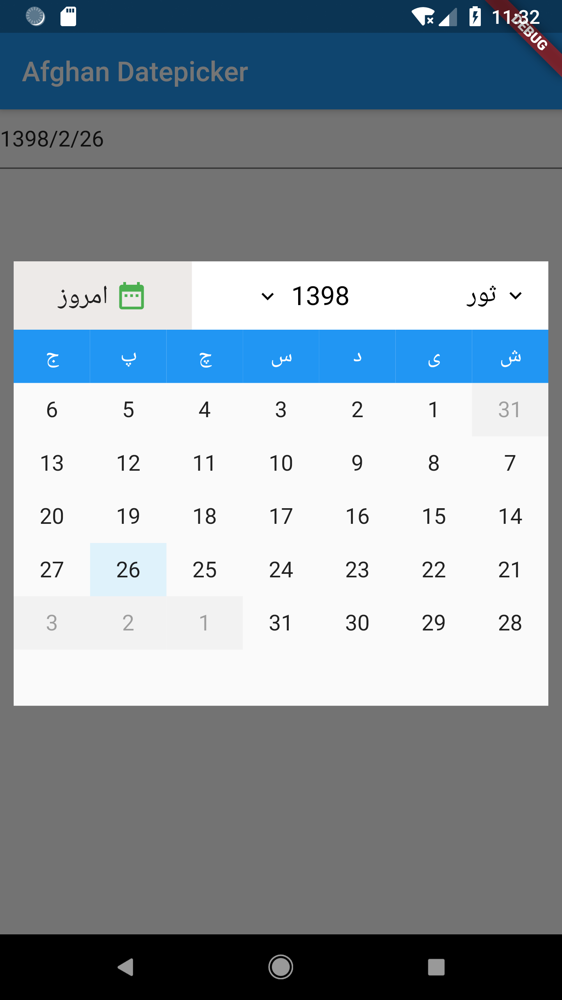
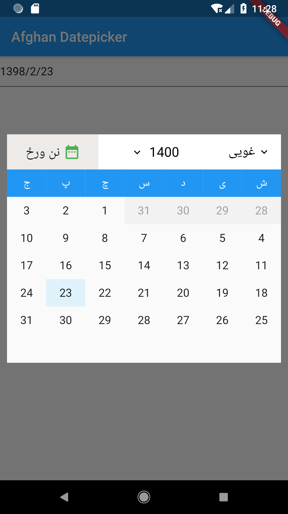

# Afghan Datepicker

A Dari/Pashto datepicker package for flutter.

### Usage

**main.dart**

```sh
import 'package:flutter/material.dart';
import 'package:afghan_datepicker/afghan_datepicker.dart';

void main() {
  runApp(Home());
}

class Home extends StatefulWidget {
  @override
  HomeState createState() {
    return new HomeState();
  }
}

class HomeState extends State<Home> {
  final TextEditingController textEditingController = TextEditingController();

  AfghanDatePicker persianDatePicker;

  @override
  void initState() {
    persianDatePicker = AfghanDatePicker(
      controller: textEditingController,
      locale: "ps",  // 'fa' for Dari
    );

    super.initState();
  }

  @override
  Widget build(BuildContext context) {
    return MaterialApp(
      home: Scaffold(
        appBar: AppBar(
          title: Text('Afghan Datepicker'),
        ),
        body: Builder(builder: (BuildContext context) {
          return Material(
            child: Container(
              child: TextField(
                enableInteractiveSelection: false,
                onTap: () {
                  FocusScope.of(context).requestFocus(new FocusNode());
                  showDialog(
                    context: context,
                    builder: (BuildContext context) {
                      return Center(
                        child: Container(
                          padding: EdgeInsets.all(10),
                          child: persianDatePicker),
                      );
                    },
                  );
                },
                controller: textEditingController,
              ),
            ),
          );
        }),
      ),
    );
  }
}
```

### HOW IT LOOKS






### Credits
https://github.com/Ali-Azmoud/persian_datepicker
